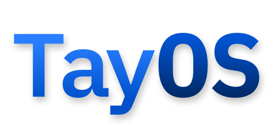

<div align="center">
    
</div>

# Overview

TayOS is a set of scripts to build a very basic busybox operating system. It was intended for me to
learn more about Linux build tools and the process of building real embedded Linux distributions 
like Yocto and Alpine. 

# Getting started

For a breakdown of every step, visit the [blog post](https://makerforce.io/make-your-own-linux/) I wrote.

## Environment

```
# Starts a Alpine build environment and fetches our sources
./build-in-docker.sh
```

You may need to prepend sudo to start the Docker container. The subsequent scripts should be run
inside our build environment.

## Kernel

```
# Configure and build the kernel sources
./00-kernel.sh
```

## Busybox

```
# Configure and build Busybox
./01-busybox.sh
```

## Initial Root Filesystem

Take a look inside `rootfs/`. In there is the initalization script `init` that is started after the
kernel loads the initial root filesystem into memory. This script sets up the required virtual 
filesystems for a working Linux system (like `/dev`, `/proc`) and then starts the real PID 0 `init`
daemon. 

```
# Copies busybox and rootfs/ into a initramfs image
./30-initramfs.sh
```

## Testing

If you have QEMU installed, you can test the image outside of the Docker container.

```
./test-in-qemu.sh
```

You may need to prepend sudo.

